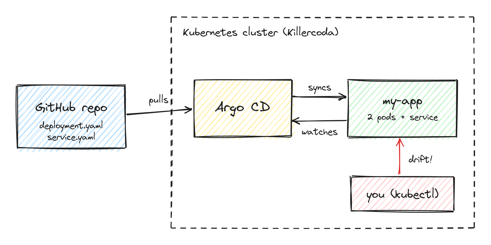

# GitOps and continuous reconciliation with Argo CD

## Why this matters

Imagine that someone gets an alert at night. To fix it fast, they run `kubectl scale` or `kubectl edit` directly on the production cluster, and they don't tell anyone. After some days, the cluster is not the same as what the team thinks is deployed. The next release can remove the fix, or it can fail because of it. This difference between the configuration we wrote and what is really running is called configuration drift.

With push-based Infrastructure as Code tools like Terraform, Ansible or a CI job with `kubectl apply`, the two states are only compared when someone runs the tool. If nobody runs it, nobody sees the drift.

GitOps is a way to solve this. The desired state is saved in Git, and an agent inside the cluster compares it all the time with the live state. If there is a difference, the agent fixes it. In this tutorial the agent is Argo CD.

## Learning outcomes

After this tutorial you should be able to:

1. Explain the main ideas of GitOps (declarative configuration, Git as the source of truth, pull-based deployment and continuous reconciliation).
2. Deploy an application with an Argo CD `Application` resource and check if it is `Synced` and `Healthy`, in the terminal and in the web UI.
3. Create configuration drift with `kubectl` and see how Argo CD finds it (`OutOfSync`) and repairs it with self-healing.
4. Discuss when it is a good idea to use GitOps with Argo CD and when it has problems, for example with secrets or urgent fixes.

## Architecture

The setup has three parts:

- The Git repository [s-riviere/kth-devops-tutorial](https://github.com/s-riviere/kth-devops-tutorial). The folder `gitops-argocd/gitops/app/` has a `Deployment` with 2 nginx Pods and a `Service`. This is the desired state.
- Argo CD, in the `argocd` namespace. It has different components. The repo-server gets the manifests from Git, the application-controller compares them with the cluster and applies the changes, and argocd-server is the web UI.
- The application, in the `default` namespace. This is the live state.

Argo CD checks two things. It checks Git for new commits (every 3 minutes by default), and it also watches the cluster with the Kubernetes API. This is why a manual change is found in a few seconds. If the two states are different and `selfHeal` is on, the controller applies the version from Git again.

## Environment

Everything runs in the browser, on a Kubernetes cluster with one node from Killercoda. You don't need an account and you don't need to install anything. A script in the background installs Argo CD (version `v3.5.3`) and opens the web UI on port 8080. This takes up to two minutes, and the first step waits for it.

The tutorial takes around 15-20 minutes.
